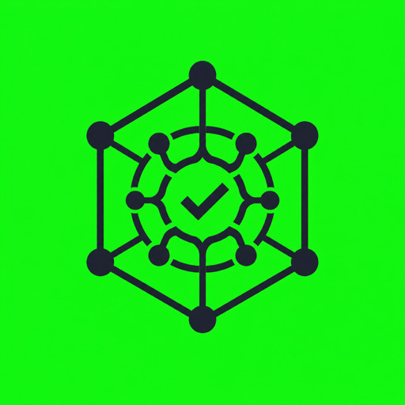

<div align="center">



# iotbrain

**The collective brain for edge-IoT development**

Install it into Claude Code and your agent starts every edge-IoT task with what the community has already verified — and everything it learns in your sessions flows back into the brain for everyone. NVIDIA Jetson is the first fully seeded platform.

[](https://rulense.github.io/iotbrain/)
[](LICENSE)
[](CONTRIBUTING.md)

</div>

<!-- IOTBRAIN_STATS_START -->
**62** brain entries · **21** skills · **6** domains · **6** platforms — last updated 2026-07-21
<!-- IOTBRAIN_STATS_END -->

## Why

IoT knowledge is scattered and perishable. How to deploy a model with TensorRT on a Jetson Orin. Which kernel and driver combination gets a CSI camera working on a Raspberry Pi 5. How to do OTA updates on an ESP32 fleet without bricking it. How to cross-compile a library for an ARM target. What breaks along the way, and how to get past it.

All of it exists — spread across vendor forums, sample repos, release notes, and the hard-won experience of engineers. None of it is in one place an agent, or a human, can reliably draw on. So every team — and every AI coding agent — relearns its devices from scratch.

## What it is

iotbrain is a **Claude Code plugin** with two parts:

**The Brain** — a grep-able knowledge base of markdown entries covering the whole edge-IoT development lifecycle, scoped per device and platform. Not a troubleshooting database: a general knowledge store. Entry types:

| Type | What it captures | Example |
|---|---|---|
| `recipe` | A verified way to accomplish a task | Deploy YOLO with TensorRT on Orin Nano, end to end |
| `config` | A known-working configuration | JetPack 6.1 + PyTorch 2.5 wheel + cuDNN combo that works |
| `matrix` | Version compatibility knowledge | CUDA × TensorRT × framework support across JetPack releases |
| `gotcha` | A trap to avoid proactively | nvarguscamerasrc quirk on JP6.0 that silently drops frames |
| `fix` | An error and its verified solution | `libcudnn.so.8` import failure → exact resolution |

**The Skills** — how the agent puts the brain to work: a main `iot-dev` companion skill that identifies the device and vendor, then consults the brain for *any* edge-IoT task (NVIDIA Jetson today; Raspberry Pi, ESP32, and other boards as the brain grows), and a `brain-distill` skill that grows the brain. Domain skills for the major workflows — `vision-pipeline`, `iot-connect`, and `sdk-build` — carry the procedural playbooks and consult the brain before and during every task.

## The loop — for every task, not just broken ones

```
 any edge-IoT task: build, deploy, integrate, optimize, debug
                            │
                            ▼
              consult the brain (grep, version-aware)
                            │
              ┌─────────────┴──────────────┐
        brain knows                  brain is silent
              │                            │
     apply known recipes,        figure it out: research the
     configs, avoid gotchas      internet, experiment, verify
              │                            │
              └─────────────┬──────────────┘
                            ▼
          learned something new & verified?
                            │
                            ▼
        distill it into the brain → community PR
```

Building a vision pipeline that works produces a `recipe`. Finding a wheel combo that imports cleanly produces a `config`. Losing an hour to a silent camera driver quirk produces a `gotcha`. Debugging is just one of the ways the brain grows.

## Setup

### Install as a plugin

Two steps inside Claude Code:

```
/plugin marketplace add Rulense/iotbrain
/plugin install iotbrain@iotbrain
```

That loads:

- **`iot-dev`** — the companion: identifies the device and vendor, consults the brain before any edge-IoT task, applies version-matched knowledge.
- **`brain-distill`** — the distiller: turns hardware-verified session learnings into brain entries and community PRs.
- **`vision-pipeline`, `iot-connect`, `sdk-build`** — the domain skills: procedural playbooks for vision pipelines, connectivity/fleet, and building/packaging, each wired into the brain.
- **16 vendored device skills** — nine NVIDIA Jetson skills plus seven from Seeed, D-Robotics, Espressif, and the Zephyr ecosystem.

Skills load lazily: until one is used, only its name and one-line description sit in the agent's context. Works whether Claude Code runs on the device itself or on a host machine reaching the device over SSH.

### What happens on first use

Give the agent any edge-IoT task and `iot-dev` runs the loop:

1. **Device facts first.** It identifies the board, vendor, and OS/SDK version (on the device, or over SSH from a host) before doing anything else.
2. **Brain consult.** It greps the brain with exact error strings, package names, and device models, filters entries by vendor and version applicability, applies what matches — and surfaces gotchas before you hit them.
3. **Distill.** Anything new it learns and verifies on real hardware, `brain-distill` turns into a draft entry and — only with your approval — a community PR.

Knowledge you choose not to contribute stays in a private local overlay at `~/.iotbrain/local/`, consulted right beside the shared brain. The overlay is auto-initialized on first use (six domain directories, a README, and an entry template) — nothing in it is ever pushed without your approval.

### Contributor / dev setup

```bash
git clone https://github.com/Rulense/iotbrain
cd iotbrain
pip install -r requirements-dev.txt

python3 -m pytest tests/                  # test suite
python3 scripts/lint_brain.py brain       # entry lint: frontmatter, keys, sources
python3 scripts/gen_updates.py --check    # site/README stats are current
```

If you add or change brain entries or skills, regenerate the website data and README stats before committing — CI enforces this:

```bash
python3 scripts/gen_updates.py
```

## How it works

- **No infrastructure.** The brain is plain markdown in this repo. Retrieval is grep — exact error strings, package names, and device models are the search keys, which is what agents search best. No vector database, no Docker, no index to go stale.
- **Version-aware.** Every entry is scoped to platform/SDK versions and device models (JetPack/L4T versions and Jetson models for today's entries). The agent checks applicability before trusting knowledge, so nothing stale gets confidently misapplied. Entries also carry a `company` field naming the device vendor — v0.1 content is NVIDIA Jetson, and the brain broadens to other edge-IoT vendors over time.
- **Human-reviewed growth.** The only write path into the shared brain is a pull request. The distiller formats entries; the community reviews truth. Nothing is published without the contributing user approving the exact content first.
- **Transparent verification.** An entry is `verified` only when it worked on real hardware (confirmed by the contributor or the cited thread's author) or is stated by the vendor's current official docs, cited with a check date — everything else is honestly marked `unverified` until confirmed. Junk doesn't get in, and provenance is always transparent.
- **Safety gate.** Flashing, partitioning, fuse-burning, and boot-config commands trigger an explicit confirm-with-context prompt before they run.

## What's inside

```
iotbrain/
├── skills/
│   ├── iot-dev/               # the companion: brain consultation for any edge-IoT task
│   ├── brain-distill/         # turns verified learnings into brain entries + PRs
│   ├── jetson-* (9)           # vendored NVIDIA device skills — see ATTRIBUTION.md
│   ├── … (7 more)             # vendored skills from Seeed, D-Robotics, Espressif, Zephyr
│   ├── vision-pipeline/       # cameras, GStreamer, DeepStream
│   ├── iot-connect/           # MQTT, cloud backends, fleet/edge deployment
│   └── sdk-build/             # building libraries & SDKs for edge targets
└── brain/
    ├── INDEX.md               # one line per entry — the map of what the brain knows
    ├── setup/                 # flashing, boot, OS install, recovery
    ├── ml-stack/              # CUDA, cuDNN, TensorRT, frameworks, model deployment
    ├── vision/                # cameras, capture, GStreamer, DeepStream pipelines
    ├── iot/                   # connectivity, cloud integration, fleet management
    ├── sdk-dev/               # building & packaging libraries/SDKs for the platform
    └── runtime/               # power modes, thermals, containers, performance
```

## Bundled & companion skills

Sixteen vendored device skills ship in `skills/` — nine NVIDIA Jetson skills plus seven from Seeed, D-Robotics, Espressif, and the Zephyr ecosystem. The full ecosystem — what's bundled, what to install alongside it, and how each entry was vetted — is catalogued in [`SKILLS-CATALOG.md`](SKILLS-CATALOG.md). Vendoring provenance and pinned upstream commits are in [`ATTRIBUTION.md`](ATTRIBUTION.md).

## Contributing

The brain only gets smarter if verified knowledge flows back. [`CONTRIBUTING.md`](CONTRIBUTING.md) defines the entry template and the verification bar: real hardware or current official docs, exact version/device frontmatter, sources linked. The `brain-distill` skill drafts a compliant entry and PR for you — review it, approve it, done.

## Roadmap

- **v0.1 — the core.** Plugin scaffold, iot-dev + distiller skills, brain seeded across all six domains with battle-tested entries on the first platform (NVIDIA Jetson).
- **v0.2 — domain skills (shipped).** Vision pipeline (`vision-pipeline`), IoT connectivity (`iot-connect`), and SDK-building (`sdk-build`) skills wired into the brain.
- **v1.0 — community scale.** Contribution tooling, entry lifecycle automation (outdated-marking on new platform releases), coverage across vendors and device families.

---

*Built on a simple bet, backed by how the best coding agents already work: for a domain where package names, error strings, and device models are the search keys, curated markdown + grep beats any vector database — and a community PR flow beats any opaque memory service.*

Licensed under [Apache-2.0](LICENSE); vendored skills keep their upstream licenses in [`third_party_licenses/`](third_party_licenses/). Website: **<https://rulense.github.io/iotbrain/>**
